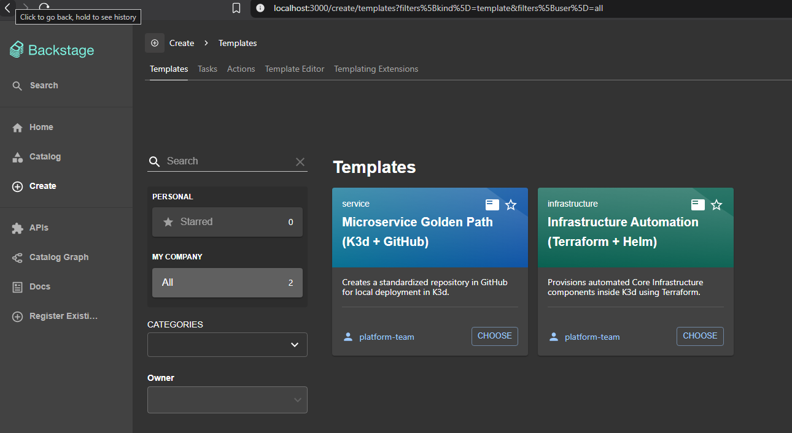
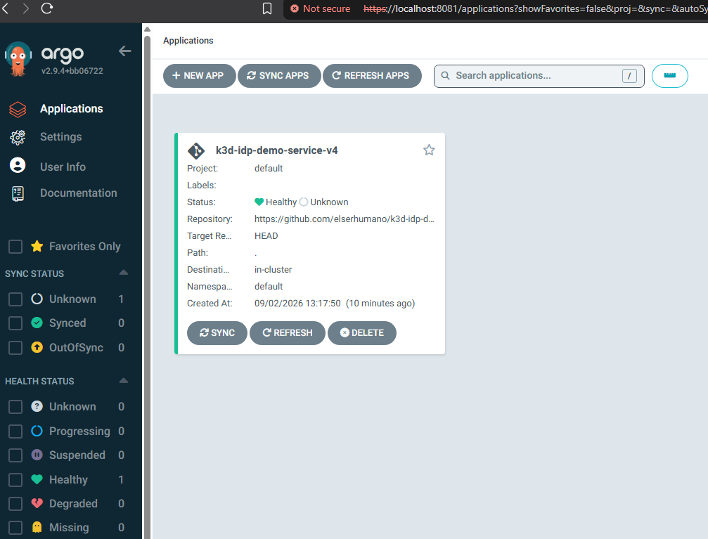

# 🗺️ Platform Engineering Certified Architect Journey

This repository serves as my official architecture portfolio, technical runbook, and preparation log for the **Certified Platform Engineer Architect** examination. It documents the implementation of a fully automated, local Internal Developer Platform (IDP) engineered on a constrained single-node workstation environment.

---

## 🏗️ Architectural Topology Overview

The core objective of this hands-on laboratory was to eliminate infrastructure drift, abstract configuration complexities for developers, and enforce strict GitOps delivery lifecycle standards utilizing a **Hub-and-Spoke** control plane topology.

```text
  [ Windows 11 Browser ] <─── Workstation Host Boundary
             │
             ▼ (Port 8080)
   [ WSL2 Ubuntu Engine ] 
             │
             ▼
     [ K3d Cluster ] ───► [ Traefik Ingress Controller ]
                                   │
         ┌─────────────────────────┴─────────────────────────┐
         ▼                                                   ▼
[ Core Portal Plane ]                               [ GitOps Engine Plane ]
 - Backstage IDP (Node v22)                          - ArgoCD (v2.9.4)
 - Dynamic Software Catalogs                         - Continuous Reconciliation Loops
 - Automated Code Generation                         - Secure State Remote Backend (K8s)
                                                             │
                                                             ▼ [ App-of-Apps Loop ]
                                                    [ k3d-idp-gitops-manifests ]
                                                             │
                                                             ▼ (Continuous Sync)
                                                    [ k3d-idp-demo-service-v4 ]
                                                    (2 Active Running Pods 🍏)

```

---

## 🚀 Orchestrated Repositories & Golden Paths

The platform logic functions via modular, decoupled repositories automatically provisioned by my Backstage Software Templates directly into GitHub. The ecosystem is split into two independent architectural pillars:

### 🐋 1. Application Layer (Microservices)
- **Repository Name:** `k3d-idp-demo-service-v4`
- **Role:** Handles pure, decoupled product business logic.
- **Technology Stack:** Node.js 20 Minimal Alpine base runtime.
- **Platform Automation:** Automatically bootstrapped with dedicated Kubernetes Deployment, Service, and Ingress manifests. Enforces zero embedded code within infrastructure definitions via native volume mounting strategies.

### 🏗️ 2. Platform Infrastructure Layer (IaC)
- **Repository Name:** `k3d-idp-demo-argocd-v2`
- **Role:** Controls platform runtime components and core infrastructure.
- **Technology Stack:** Terraform (>= 1.5.0) paired with the HashiCorp Helm Provider.
- **Platform Automation:** Automates the lifecycle of the ArgoCD engine directly inside the K3d master nodes. Features an **Enterprise Remote Backend Architecture** that securely preserves and encripts the state file (`.tfstate`) natively inside the cluster control database (`kube-system`), avoiding critical secrets leaks on Git versioning.

### 🎡 3. GitOps Control Plane Layer (State Declarations)
- **Repository Name:** `k3d-idp-gitops-manifests`
- **Role:** Functions as the single source of truth and root registry for the entire ecosystem.
- **Technology Stack:** ArgoCD Declarative Custom Resources (`kind: Application`).
- **Platform Automation:** Implements the industry-standard **App-of-Apps architectural pattern**. It continuously scans my GitHub organization state to dynamically trigger reconciliation loops, eliminating manual CLI modifications (`ClickOps`) and automatically enforcing self-healing routines across all running cluster nodes.

---

## 🧠 Core Competencies & Advanced Troubleshooting Log

Throughout this platform engineering journey, I have successfully executed and documented advanced architecture resolution patterns under high-pressure workstation constraints:

1. **WSL2 Network Kernel Bridging:** Patched Systemd binary interactions to achieve seamless loopback communication between the Windows 11 host filesystem and localized container runtimes.
2. **Backstage Nunjucks Escaping Loops:** Resolved multi-pass string parsing conflicts within nested YAML templates by engineering proper block escaping strings (`${{ '{{' }} ... ${{ '}}' }}`) for automated skeleton files.
3. **State Amnesia & Reconstruction via IaC CLI:** Recovered an absolute control plane failure caused by a lost state configuration file. Safely reconstructed the architecture live data using complex sequential commands:
   ```bash
   terraform import helm_release.k3d-idp-demo-argocd-v2 k3d-idp-demo-argocd-v2/k3d-idp-demo-argocd-v2
   ```
4. **Volume Binding Perms on Alpine Contaniers:** Resolved a `MODULE_NOT_FOUND` container failure loop on native Node images by altering the execution layout toward explicit shell overrides (`sh -c`) and absolute path mappings.
5. **Helm Array Data Compilations:** Overrode Traefik ingress multi-host collision blocks by enforcing proper curly brace syntax parsing (`{localhost}`) to align with underlying strict Go chart ranges.

---

## 🎓 Next Milestones

- [x] Provision a local multi-tenant developer platform via Backstage IDP.
- [x] Standardize infrastructure lifecycle patterns using decoupled Terraform remote states.
- [x] Bootstrapp and verify GitOps engine loops with ArgoCD Core systems.
- [x] Implement multi-cluster control plane architectures (Hub-and-Spoke enterprise pattern simulation).

---

## 🖼️ Visual Proof & Platform Dashboards

### 🔹 1. Multi-Template Core Catalog (Backstage IDP)
This dashboard showcases the standardized enterprise self-service catalog, featuring both decoupled golden paths natively active inside the cluster control layer.




### 🔹 2. GitOps Continuous Reconciliation Loop (ArgoCD Engine)
This screen confirms the successful target state synchronization of the application layer. The system continuously tracks the master repository to prevent infrastructure drift.


